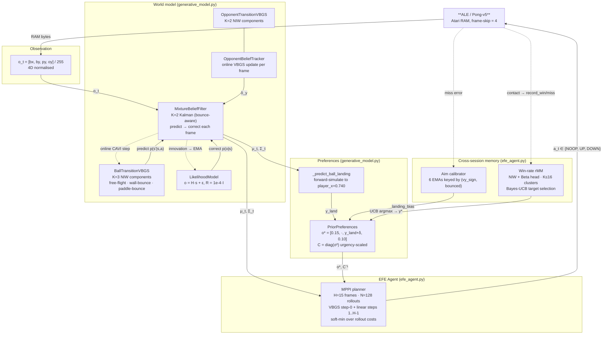

# Active Inference Pong — Mathematics

> **Current implementation:** MPPI receding-horizon planner with greedy nominal, adaptive EMA target smoothing, urgency-scaled preference covariance, opponent-aware placement, and cross-session Bayesian aim calibration.

---

## 0. Problem and architecture

### 0.1 Problem description

**ALE/Pong-v5** is a two-player video game in which each player controls a vertical paddle. The right player (agent) must intercept a moving ball with its paddle and return it past the left opponent's paddle to score. The first to reach 21 points wins; an episode ends when either player reaches that score.

The agent reads four bytes directly from the Atari 2600 RAM each frame:

| Signal | RAM byte | Range |
|--------|----------|-------|
| Ball x | 49 | 0–255 |
| Ball y | 54 | 0–255 |
| Player paddle y | 51 | 0–255 |
| Opponent paddle y | 50 | 0–255 |

All values are normalised to $[0,1]$. The **ball velocity** is not available in any single frame — it is a latent variable that must be inferred from the sequence of observations.

**What makes this hard:**

- *Latent dynamics.* Neither velocity nor acceleration is directly observable. The agent must maintain a probabilistic belief over the full 6D state $[b_x, b_y, \dot b_x, \dot b_y, p_y, o_y]$ and propagate it forward in time.
- *Non-linear bounce dynamics.* The ball reflects off the top and bottom walls (sign flip in $\dot b_y$) and off both paddles (sign flip in $\dot b_x$). A single Gaussian cannot represent the bimodal predictive distribution at bounce events.
- *Adversarial opponent.* The opponent tracks the ball reactively. Winning requires not just intercepting the ball but placing the return where the opponent cannot reach it.
- *Tight timing.* The paddle moves $\approx 0.060$ normalised units per frame (frame-skip = 4). Missing a rally by one paddle-step is enough to lose the point.

**What the agent does NOT use:**

- No reward signal, no policy network, no value function.
- No replay buffer, no gradient descent, no neural networks.
- No hand-crafted game-specific heuristics beyond the choice of RAM bytes.

**What the agent DOES use:**

The agent is built on **Active Inference** (Friston et al.) — a framework in which behaviour emerges from minimising a single objective, the **Expected Free Energy** (EFE). At each frame the agent asks: *which action leads to a future that best matches my preferred observations?* Preferences encode the goal (intercept the ball, put it past the opponent); the world model (VBGS) encodes how the game evolves; MPPI searches for the action sequence that minimises EFE over a 15-frame horizon.

**Current performance** (frozen VBGS, rMM win-rate model, 30 episodes):

| Agent | Mean score |
|-------|-----------|
| Rule-based (track ball y) | −14.4 |
| EFE H=3, intercept target | −6.6 |
| EFE frozen, rMM, 30 eps | −7.4 |

The EFE agent beats the rule-based baseline by **+7 points** on average and regularly wins individual episodes.

---

### 0.2 Block diagram



**Signal flow (solid arrows):** each frame, the environment emits a RAM observation → the Belief Filter predicts and corrects to produce $(\mu_t, \Sigma_t)$ → the MPPI planner evaluates 128 perturbed rollouts against the preference target → the lowest-EFE first action is sent back to the environment.

**Learning flow (dashed arrows):** the VBGS and likelihood noise $R$ are refined online from live transitions and Kalman innovations; the win-rate rMM and aim calibrator accumulate rally outcomes across sessions.

---

## 1. State and observations

The agent reads a small number of bytes from the Atari 2600 RAM on every simulated frame, rather than processing raw pixel images. This section defines those signals and the 6D latent state built on top of them. Getting the state space right determines what the generative model must explain — too few dimensions and the agent is blind to critical dynamics; too many and fitting slows without benefit. The key design constraint here is that **velocities are not available** from a single frame: they must be inferred by the belief filter (§9) from the sequence of positions. This is why the state is strictly larger than the observation — the observation tells us where things are, but the state also encodes how fast they are moving.

All RAM bytes are normalised to $[0,1]$ by dividing by 255.

### 1.1 Ball state

$$
s^b_t = \begin{bmatrix} b_x \\ b_y \\ \dot b_x \\ \dot b_y \end{bmatrix} \in \mathbb{R}^4
$$

Velocities are computed by frame differencing:

$$
\dot b_t = b_t - b_{t-1}
$$

### 1.2 Opponent state

$$
s^o_t = \begin{bmatrix} o_y \end{bmatrix} \in \mathbb{R}^1
$$

### 1.3 RAM addresses used

| Symbol | RAM index | Meaning |
|--------|-----------|---------|
| $b_x$  | 49        | Ball x position |
| $b_y$  | 54        | Ball y position |
| $p_y$  | 51        | Player paddle y (right) |
| $o_y$  | 50        | Opponent paddle y (left) |

The four observable positions combine with two latent velocities to form the **full 6D state** $s = [b_x,\, b_y,\, \dot b_x,\, \dot b_y,\, p_y,\, o_y]^\top$ used throughout §8–§9. The transition models (§5) learn to predict $s_{t+1}$ from $s_t$; the likelihood model (§8) connects the 6D state back to the 4D observation via the $H$ matrix.

---

## 2. Normal-Inverse-Wishart prior

Every component of the mixture models in this system — the VBGS transition model (§3), the win-rate rMM (§17) — stores its sufficient statistics as a Normal-Inverse-Wishart (NIW) distribution over the component's mean and precision matrix. The NIW family is the **conjugate prior** to the multivariate Gaussian likelihood: this means that after observing data, the posterior has the same parametric form as the prior, and the update reduces to simple arithmetic on four numbers $(\mathbf{m}_k, \kappa_k, \nu_k, \mathbf{W}_k)$ rather than an integral. Conjugacy is the reason the whole system is gradient-free — every learning step is a closed-form update, not a gradient descent step. This section derives the two quantities used repeatedly in CAVI: the expected log-determinant of the precision (used in the E-step responsibilities) and the expected Mahalanobis distance (used to score how well a data point fits each component).

Each mixture component $k$ has a Gaussian likelihood with unknown mean $\mu_k$ and precision $\Lambda_k$.  
The conjugate prior is the Normal-Inverse-Wishart (NIW):

$$
p(\mu_k, \Lambda_k) = \mathcal{NIW}(\mathbf{m}_k,\, \kappa_k,\, \nu_k,\, \mathbf{W}_k)
$$

with hyperparameters:

| Symbol | Meaning |
|--------|---------|
| $\mathbf{m}_k \in \mathbb{R}^d$ | prior mean |
| $\kappa_k > 0$ | mean pseudo-count |
| $\nu_k > d - 1$ | degrees of freedom |
| $\mathbf{W}_k \in \mathbb{R}^{d \times d}$ | scale matrix |

### 2.1 Variational expectations

Under the variational posterior $q(\Lambda_k) = \mathcal{W}(\nu_k, \mathbf{W}_k)$:

$$
\mathbb{E}\!\left[\log|\Lambda_k|\right]
= \sum_{i=0}^{d-1} \psi\!\left(\frac{\nu_k - i}{2}\right) + d\ln 2 + \ln|\mathbf{W}_k|
$$

where $\psi$ is the digamma function.

Under $q(\mu_k, \Lambda_k) = \mathcal{NIW}(\mathbf{m}_k, \kappa_k, \nu_k, \mathbf{W}_k)$:

$$
\mathbb{E}\!\left[(\mathbf{x} - \mu_k)^\top \Lambda_k\, (\mathbf{x} - \mu_k)\right]
= \frac{d}{\kappa_k} + \nu_k\,(\mathbf{x} - \mathbf{m}_k)^\top \mathbf{W}_k^{-1}(\mathbf{x} - \mathbf{m}_k)
$$

### 2.2 Posterior update (CAVI M-step)

Given effective count $N_k$, weighted mean $\bar{\mathbf{x}}_k$, and scatter $\mathbf{S}_k$:

$$
\kappa_k^* = \kappa_k + N_k
\qquad
\mathbf{m}_k^* = \frac{\kappa_k \mathbf{m}_k + N_k \bar{\mathbf{x}}_k}{\kappa_k^*}
$$

$$
\nu_k^* = \nu_k + N_k
$$

$$
\mathbf{W}_k^* = \mathbf{W}_k + \mathbf{S}_k
+ \frac{\kappa_k N_k}{\kappa_k^*}\,(\bar{\mathbf{x}}_k - \mathbf{m}_k)(\bar{\mathbf{x}}_k - \mathbf{m}_k)^\top
$$

### 2.3 Posterior predictive

**Two stacked approximations apply here — neither is exact.**

**Approximation 1 — variational M-step (CAVI).** In a mixture model the true posterior over parameters is not NIW because the latent assignments $\mathbf{Z}$ couple all components. CAVI imposes the mean-field factorisation $q = q(\mathbf{Z})\prod_k q(\mu_k,\Lambda_k)$. The conjugate prior guarantees the *form* of each factor remains NIW and the M-step stays closed-form, but $\mathbf{W}_k^*$ is the scale of the **variational** posterior, not the exact Bayesian posterior.

**Approximation 2 — Gaussian predictive.** The exact posterior predictive under the NIW is a multivariate Student-$t$ with scale:

$$
\Sigma_\text{pred}^{\text{exact}} = \frac{\kappa_k+1}{\kappa_k(\nu_k - d + 1)}\,\mathbf{W}_k
$$

This implementation uses the Inverse-Wishart posterior mean instead (a Gaussian approximation):

$$
\hat{\Sigma}_k = \frac{\mathbf{W}_k}{\nu_k - d - 1} \qquad (\nu_k > d+1)
$$

The two scales differ by the factor $\frac{(\kappa_k+1)(\nu_k-d-1)}{\kappa_k(\nu_k-d+1)}$, which deviates non-trivially from 1 when component counts $N_k$ are small (early training). Both approximations improve as $N_k \to \infty$: the mean-field bias vanishes and the Student-$t$ converges to a Gaussian, so the two scales converge.

The NIW posterior update (§2.2) is called at two places in the system: the batch CAVI M-step during pretraining (§3.2), and the single-sample online update during play (§6, §17.2). In both cases the same four equations apply — only the effective count $N_k$ differs (batch vs 1).

---

## 3. Variational Bayesian Gaussian Sum (VBGS)

The VBGS is the agent's probabilistic "physics engine". It is a **joint Gaussian Mixture Model** trained over input-output pairs $(s_t, s_{t+1})$: by fitting a mixture over the joint space, each component captures a distinct dynamical regime (free flight, wall bounce, paddle bounce), and the conditional distribution $p(s_{t+1} \mid s_t)$ is recovered analytically by Gaussian conditioning (§4). This is the model used in the predict step of the belief filter (§9) and at step-0 of every MPPI rollout (§15).

Fitting is done with **Coordinate Ascent Variational Inference (CAVI)** — an iterative algorithm that alternates between a soft E-step (assigning each data point to components in proportion to how well it fits) and an M-step (updating the NIW parameters of each component using the soft assignments). CAVI is an approximation to exact Bayesian inference: it imposes a mean-field factorisation over the latent variables, which makes each factor update tractable but introduces a bias that vanishes as data accumulates. The advantage over EM (maximum-likelihood) is that the NIW prior regularises each component automatically, preventing the degenerate solutions (collapsed covariance, zero-weight components) that plague EM on small datasets.

A joint GMM over $(\mathbf{x}, \mathbf{y})$ with $K$ components.  
The full variational family is:

$$
q(\mathbf{Z}, \boldsymbol{\pi}, \{\mu_k, \Lambda_k\})
= q(\mathbf{Z})\,q(\boldsymbol{\pi})\prod_k q(\mu_k, \Lambda_k)
$$

with $q(\boldsymbol{\pi}) = \mathrm{Dir}(\boldsymbol{\alpha})$ and each $q(\mu_k,\Lambda_k) = \mathcal{NIW}(\mathbf{m}_k,\kappa_k,\nu_k,\mathbf{W}_k)$.

### 3.1 CAVI E-step — responsibilities

For data point $\mathbf{x}_n$ and component $k$:

$$
\ln \tilde{r}_{nk}
= \psi(\alpha_k) - \psi\!\left(\sum_j \alpha_j\right)
+ \frac{1}{2}\,\mathbb{E}[\ln|\Lambda_k|]
- \frac{d}{2}\ln(2\pi)
- \frac{1}{2}\,\mathbb{E}\!\left[(\mathbf{x}_n - \mu_k)^\top\Lambda_k(\mathbf{x}_n - \mu_k)\right]
$$

$$
r_{nk} = \frac{\tilde{r}_{nk}}{\sum_j \tilde{r}_{nj}}
$$

### 3.2 CAVI M-step — sufficient statistics

$$
N_k = \sum_n r_{nk}
\qquad
\bar{\mathbf{x}}_k = \frac{1}{N_k}\sum_n r_{nk}\,\mathbf{x}_n
\qquad
\mathbf{S}_k = \sum_n r_{nk}\,(\mathbf{x}_n - \bar{\mathbf{x}}_k)(\mathbf{x}_n - \bar{\mathbf{x}}_k)^\top
$$

$$
\alpha_k^* = \alpha_0 + N_k
$$

Then apply the NIW update from §2.2 for each component.

### 3.3 Mixing weights

The posterior mixing proportions are:

$$
\hat\pi_k = \frac{\alpha_k}{\sum_j \alpha_j}
$$

After pretraining on $\sim$30,000 frames the ball VBGS converges to component weights approximately $[0.29,\, 0.46,\, 0.25]$ — wall bounces are the most frequent regime, consistent with the ball spending the majority of each rally bouncing off the top and bottom walls. The opponent VBGS converges faster (1D output) and is already usable after a few hundred frames. With sufficient data the M-step degenerates to a single-sample update (§6), enabling online refinement with negligible computational cost.

---

## 4. Conditional prediction

Training a joint GMM over $(s_t, s_{t+1})$ pairs gives a model of the *joint* distribution. To use it for prediction — given where the ball is now, where will it be next? — we need the *conditional* $p(s_{t+1} \mid s_t)$. This section derives that conditional for a single Gaussian component and then forms the mixture. The key insight is that a jointly Gaussian distribution has a Gaussian conditional obtainable by the standard Schur-complement formula: the result is exact (no approximation) within each component, and the mixture is reweighted by how probable the observed $s_t$ is under each component's marginal. This reweighting is what activates the correct dynamical regime — the wall-bounce component gets high weight when the ball is near a wall, the free-flight component elsewhere.

The joint NIW for component $k$ defines a joint Gaussian $(\mathbf{x}, \mathbf{y}) \sim \mathcal{N}(\boldsymbol{\mu}_k, \hat\Sigma_k)$.  
Partitioned as:

$$
\boldsymbol{\mu}_k = \begin{bmatrix}\boldsymbol{\mu}_x \\ \boldsymbol{\mu}_y\end{bmatrix}
\qquad
\hat\Sigma_k = \begin{bmatrix}\Sigma_{xx} & \Sigma_{xy} \\ \Sigma_{yx} & \Sigma_{yy}\end{bmatrix}
$$

The conditional $p(\mathbf{y}\mid\mathbf{x}, k)$ is Gaussian:

$$
\mathbf{y} \mid \mathbf{x},\, k \;\sim\; \mathcal{N}\!\left(\,\boldsymbol{\mu}_y + \Sigma_{yx}\Sigma_{xx}^{-1}(\mathbf{x} - \boldsymbol{\mu}_x),\;\; \Sigma_{yy} - \Sigma_{yx}\Sigma_{xx}^{-1}\Sigma_{xy}\,\right)
$$

### 4.1 Component weights for prediction

When conditioning on $\mathbf{x}$, component weights are re-scored using the marginal likelihood:

$$
w_k \propto \hat\pi_k \cdot p(\mathbf{x} \mid k)
\qquad
p(\mathbf{x}\mid k) = \mathcal{N}(\mathbf{x};\;\boldsymbol{\mu}_x^k,\;\Sigma_{xx}^k)
$$

### 4.2 Mixture predictive mean

$$
\hat{\mathbf{y}} = \sum_k w_k\,\boldsymbol{\mu}_{y|x}^k
$$

The mixture predictive is used in two ways downstream. In the **belief filter** (§9) it provides the predicted mean and covariance for the Kalman predict step, collapsed to a single Gaussian by moment-matching. In the **MPPI rollouts** (§15) only step-0 uses the full VBGS conditional; deeper steps switch to a cheap linear model to keep the per-frame compute budget under 7 ms.

---

## 5. Transition models

This section instantiates the VBGS architecture (§3–4) for the two dynamical subsystems the agent must predict: the ball and the opponent paddle. Each model receives weak physics-informed priors that seed the component means at physically plausible values — free-flight velocity, wall-bounce sign flip, paddle-bounce sign flip. These priors are deliberately weak (small pseudo-counts $\kappa_0 = 1$, $\nu_0 = d+2$) so that they are overridden after a few dozen real observations. The purpose of the prior is not to impose structure but to prevent the model from starting in a degenerate configuration and to ensure that even the first few frames of a new episode produce sensible action choices.

### 5.1 Ball transition model

Models $p(s^b_{t+1} \mid s^b_t)$ as a conditional GMM with $K=3$ components.

**Joint data:** $\mathbf{z}_t = [s^b_t;\; s^b_{t+1}] \in \mathbb{R}^8$, $d_x = 4$, $d_y = 4$.

**Components and weak physics priors** (all values in $[0,1]$, $v = 0.015$):

| $k$ | Regime | Prior mean $\mathbf{m}_k$ |
|-----|--------|--------------------------|
| 0 | Free flight | $[0.5,\;0.5,\;v,\;v \;\|\; 0.5{+}v,\;0.5{+}v,\;v,\;v]$ |
| 1 | Wall bounce ($\dot b_y$ flips) | $[0.5,\;0.1,\;v,\;v \;\|\; 0.5{+}v,\;0.1{-}v,\;v,\;{-}v]$ |
| 2 | Paddle bounce ($\dot b_x$ flips) | $[0.85,\;0.5,\;v,\;v \;\|\; 0.85{-}v,\;0.5{+}v,\;{-}v,\;v]$ |

Prior hyperparameters: $\kappa_0 = 1$, $\nu_0 = d + 2 = 10$, $\mathbf{W}_0 = 0.01\,\mathbf{I}$.  
Low pseudo-counts ensure the prior is overridden after a few dozen observations.

### 5.2 Opponent transition model

Models $p(o_{t+1} \mid o_t, s^b_t, a_t)$ as a conditional GMM with $K=2$ components.

**Input:** $\mathbf{x} = [o_y,\; b_x,\; b_y,\; \dot b_x,\; \dot b_y,\; a] \in \mathbb{R}^6$

**Action encoding:**

$$
a = \begin{cases} 0 & \text{NOOP} \\ +1 & \text{UP} \\ -1 & \text{DOWN} \end{cases}
$$

**Joint data:** $\mathbf{z} = [\mathbf{x};\; o_{t+1}] \in \mathbb{R}^7$, $d_x = 6$, $d_y = 1$.

| $k$ | Regime | Prior scale |
|-----|--------|-------------|
| 0 | Tracking (confident) | $\mathbf{W}_0 = 0.005\,\mathbf{I}$ |
| 1 | Stationary / lag | $\mathbf{W}_0 = 0.02\,\mathbf{I}$ |

Both transition models are pretrained offline (`pretrain_models.py`) on $\approx$30,000 frames before any live play. The pretrained models are loaded from `models/ball_vbgs.pkl` and `models/opponent_vbgs.pkl`. During play they can be frozen (default) or updated online (§6). The opponent model is updated every frame by `OpponentBeliefTracker.update()` regardless of the frozen/online flag — its update is cheap (1D output) and its fast adaptation is needed to track the opponent's current strategy.

---

## 6. Online learning

After pretraining the world model captures average Pong dynamics, but individual games can exhibit specific quirks — slightly different bounce angles, opponent movement patterns, or frame-timing artefacts. This section describes how the pretrained transition models are continuously refined during play. Rather than freezing the world model after pretraining, the agent performs a single CAVI E+M step on every new transition. Because the NIW sufficient statistics accumulate data additively, this is statistically equivalent to full batch retraining on all data seen so far — with zero memory overhead and negligible per-frame cost ($<0.1$ ms).

Both models are updated online after each observed transition using a single CAVI iteration (one E-step + one M-step). No replay buffer — the NIW sufficient statistics accumulate incrementally.

Each frame:

1. Observe $(s_t, s_{t+1})$
2. Form joint $\mathbf{z} = [s_t;\; s_{t+1}]$
3. E-step: compute $r_{k}$ for $\mathbf{z}$
4. M-step: update $\alpha_k$, $\mathbf{m}_k$, $\kappa_k$, $\nu_k$, $\mathbf{W}_k$

Because the pretrained NIW statistics encode $\sim$30,000 frames, each new online observation shifts the posterior by approximately $1/30{,}000$ — producing slow, noise-resistant adaptation rather than catastrophic forgetting. A detailed treatment of the online learning phases and their wiring in the codebase is given in §14.

---

## 7. Prior preferences

This section encodes *what the agent wants* as a probability distribution over observations. In Active Inference the goal is not a hard constraint but a soft prior $\tilde{p}(o)$: observations close to the goal are highly probable, observations far from it are suppressed. The Expected Free Energy (§11) then drives the agent to minimise the KL divergence between predicted observations and this preference distribution, producing goal-directed behaviour without an explicit reward signal.

The agent's goals are encoded as a preferred observation distribution:

$$
\tilde{p}(o) = \mathcal{N}(o \;;\; o^*,\; C)
$$

with $o = [b_x,\; b_y,\; p_y,\; o_y]$.

### 7.1 Goals

| Goal | Mechanism |
|------|-----------|
| **G1** Ball on opponent's side | $o^*_{b_x} = 0.15$ (low = left = opponent's goal), tight $\sigma_{b_x} = 0.05$ |
| **G2** Player paddle tracks ball | $o^*_{p_y} = \mu^{b_y}$ (set from current ball belief), tight $\sigma_{p_y} = 0.03$ |
| **G3** Ball far from opponent paddle | $o^*_{o_y} = 0.10$ (pulls opponent toward wall), moderate $\sigma_{o_y} = 0.15$ |

$o^*_{b_y}$ is left loose ($\sigma = 0.20$) — the agent doesn't care where vertically the ball is, only that it reaches the opponent's side.

### 7.2 Contextual target

Goal G2 is relational: the player should track wherever the ball is. At each step the target is updated from the current state belief $\mu$:

$$
o^*_{p_y} \leftarrow \mu_{b_y}
$$

### 7.3 Analytic expectation (used in EFE)

When the predictive observation distribution is Gaussian $p(o \mid q) = \mathcal{N}(\mu_o, \Sigma_o)$, the expected log-preference has a closed form:

$$
\mathbb{E}[\log\tilde{p}(o)] = -\frac{1}{2}\left[\operatorname{tr}(C^{-1}\Sigma_o) + (\mu_o - o^*)^\top C^{-1}(\mu_o - o^*) + \log|C| + d_o\log 2\pi\right]
$$

This is the **instrumental value** term of the Expected Free Energy (Phase 3).

The preference distribution $\tilde{p}(o)$ defined here is the fixed core; §16 layers context-sensitivity on top of it by making $\sigma_{p_y}$ and the target $o^*_{p_y}$ functions of the current game state. Together §7 and §16 fully specify the right-hand input $o^*, C$ to the EFE minimisation in §11.

---

## 8. Likelihood model

This section specifies how the 4D RAM observation vector relates to the 6D latent state. The observation model $p(o\mid s)$ is a linear Gaussian (the $H$-matrix projection), which makes the downstream Kalman belief update (§9) exact. The section also derives the marginalised likelihood when the agent holds a Gaussian state belief and provides the analytic form of the observation noise $R$, which drives the Kalman gain.

### 8.1 Full state vector

The generative model operates on a 6D state that merges the ball and paddle sub-states:

$$
s = \begin{bmatrix} b_x,\; b_y,\; \dot b_x,\; \dot b_y,\; p_y,\; o_y \end{bmatrix}^\top \in \mathbb{R}^6
$$

Velocities $(\dot b_x, \dot b_y)$ are latent — they cannot be read from a single RAM frame.

### 8.2 Observation model

The 4D observation vector contains only the directly readable positions:

$$
o = \begin{bmatrix} b_x,\; b_y,\; p_y,\; o_y \end{bmatrix}^\top \in \mathbb{R}^4
$$

The likelihood is a linear Gaussian:

$$
p(o \mid s) = \mathcal{N}(o \;;\; Hs,\; R)
$$

The observation matrix $H \in \mathbb{R}^{4 \times 6}$ selects positions from the state (indices 0, 1, 4, 5):

$$
H = \begin{bmatrix}
1 & 0 & 0 & 0 & 0 & 0 \\
0 & 1 & 0 & 0 & 0 & 0 \\
0 & 0 & 0 & 0 & 1 & 0 \\
0 & 0 & 0 & 0 & 0 & 1
\end{bmatrix}
$$

The noise covariance $R = r\,\mathbf{I}_4$ with $r = 10^{-4}$, reflecting RAM quantisation noise of $\pm 1$ pixel $\approx \pm 0.004$ in normalised units.

### 8.3 Marginalised likelihood over a Gaussian belief

When the agent holds a Gaussian belief $q(s) = \mathcal{N}(\mu, \Sigma)$, the expected likelihood is obtained by marginalising over $s$:

$$
p(o \mid q) = \int p(o \mid s)\, q(s)\, ds = \mathcal{N}\!\left(o \;;\; H\mu,\; H\Sigma H^\top + R\right)
$$

### 8.4 Kalman measurement update

The observation $o_t$ updates the Gaussian belief via the standard Kalman correction:

$$
S = H\Sigma H^\top + R \qquad \text{(innovation covariance)}
$$

$$
K = \Sigma H^\top S^{-1} \qquad \text{(Kalman gain)}
$$

$$
\mu^* = \mu + K\,(o - H\mu)
$$

$$
\Sigma^* = (I - KH)\,\Sigma
$$

The log-likelihood of the innovation is:

$$
\log p(o) = -\frac{1}{2}\left(d_o \ln(2\pi) + \ln|S| + (o - H\mu)^\top S^{-1}(o - H\mu)\right)
$$

### 8.5 Online noise estimation

$R$ can be refined online from observed innovations $\nu_t = o_t - H\mu_t$ via an exponential moving average:

$$
R \leftarrow (1-\eta)\,R + \eta\,\frac{1}{N}\sum_n \nu_n \nu_n^\top
$$

with learning rate $\eta = 0.01$ (Phase 4.1).

The likelihood model occupies a critical position in the information pipeline: $H$ and $R$ appear in both the Kalman gain (§9.2) and the EFE epistemic term (§11.4). An underestimated $R$ gives the filter too much trust in noisy observations, destabilising the velocity estimates; an overestimated $R$ makes the filter sluggish and delays detection of bounces. The initial value $R = 10^{-4}\,\mathbf{I}$ is calibrated to RAM quantisation noise; online refinement (§8.5) lets it adapt to game-specific observation statistics over the course of a session.

---

## 9. Belief filter (Phase 2.1)

The belief filter is the agent's perception system: it translates the stream of raw RAM observations into a probability distribution $q(s_t) = \mathcal{N}(\mu_t, \Sigma_t)$ over the full 6D state, including the latent velocities. Without this filter the agent would have to pick actions based only on positions — it would not know whether the ball is moving toward it or away, how fast, or how uncertain that estimate is.

The filter uses a **K=2 mixture of Kalman filters** to handle the bimodal predictive distribution that arises when the ball is near a wall: one component tracks the trajectory assuming no bounce, the other assuming an imminent sign-flip of $\dot b_y$. The two hypotheses are maintained in parallel until the next observation resolves which one was correct. This makes the filter significantly more accurate near the walls than a single Gaussian (which would blur the bimodal distribution into an artificially widened Gaussian).

§9.3 shows that this predict-correct recursion is not just an engineering choice: it is what CAVI variational inference recovers for a linear-Gaussian model, making the belief filter a direct instantiation of the Active Inference perception loop.

The agent maintains a single Gaussian belief over the full 6D state:

$$q(s_t) = \mathcal{N}(\mu_t,\, \Sigma_t)$$

Each frame the belief is updated in two sequential steps.

### 9.1 Predict step

The VBGS transition models produce a mixture of Gaussians for $p(s_{t+1} \mid s_t)$.  
This is collapsed to a single Gaussian by **moment matching**:

$$\mu^- = \sum_k w_k\, \mu^k_{y|x}$$

$$\Sigma^- = \sum_k w_k\!\left(\Sigma^k_{y|x} + \mu^k_{y|x}{\mu^k_{y|x}}^\top\right) - \mu^-{\mu^-}^\top$$

Ball (4D) and opponent (1D) are predicted independently; player_y is agent-controlled and carried forward unchanged.  
A **process noise floor** $Q$ is added to prevent $\Sigma^-$ from collapsing to zero when the VBGS is well-trained:

$$\Sigma^-_{\text{pred}} \leftarrow \Sigma^- + Q, \qquad Q = \mathrm{diag}(10^{-4},\, 10^{-4},\, 10^{-4},\, 10^{-4},\, 10^{-5},\, 10^{-4})$$

### 9.2 Correct step

The new RAM observation $o_t$ is used to update the belief via the standard Kalman measurement equations (derived in §8.4):

$$S = H\Sigma^- H^\top + R \qquad K = \Sigma^- H^\top S^{-1}$$

$$\mu_t = \mu^- + K(o_t - H\mu^-) \qquad \Sigma_t = (I - KH)\,\Sigma^-$$

### 9.3 Why this is CAVI

Minimising the variational free energy $F = \mathbb{E}_q[\log q(s) - \log p(s,o)]$ over the Gaussian family yields exactly these predict-correct equations. CAVI = Kalman for linear-Gaussian models — no approximation is made.

### 9.4 What the belief recovers

| Quantity | Source |
|----------|--------|
| $\mu_{b_x}, \mu_{b_y}$ | Smoothed ball position (less noisy than raw RAM) |
| $\mu_{\dot b_x}, \mu_{\dot b_y}$ | Ball velocity — **latent**, not in any single RAM frame |
| $\Sigma$ diagonal | Per-dimension uncertainty — feeds epistemic EFE term in Phase 3 |

The belief $(\mu_t, \Sigma_t)$ is the single input to all downstream computation: the landing predictor (§13) reads $\mu$ to simulate ball trajectory; the EFE (§11) and MPPI planner (§15) use both $\mu$ and $\Sigma$; the win-rate rMM (§17) is queried with the predicted opponent y derived from $\mu$. Accurate velocity estimation is the single most important factor in landing prediction quality — a 2-frame lag in detecting a bounce produces a $\sim$0.12 normalised-unit error in the predicted landing y, which is comparable to the paddle half-width.

---

## 10. Validation results

This section reports the predictive accuracy of the pretrained VBGS transition models before any online refinement. The numbers serve two purposes: they confirm the models are useful as a starting point (errors well below the paddle half-width), and they establish a baseline against which online refinement can be measured.

After pretraining on 30,053 frames (~15 s at 2,000 fps):

| Model | MAE | Pixels ($\times 255$) |
|-------|-----|----------------------|
| Ball position | 0.0089 | ≈ 2.3 px |
| Opponent position | 0.0193 | ≈ 4.9 px |

Final ball component weights: $[0.29,\; 0.46,\; 0.25]$.  
Component 1 (wall bounce) dominates, consistent with the ball spending most time bouncing off the top and bottom walls.

The ball MAE of 2.3 px is well below the paddle half-width of $\approx$12 px: the filter predicts where the ball will be within a quarter-paddle-width, giving the planner a reliable target to aim for. The opponent MAE of 4.9 px is larger but still within the paddle half-width, sufficient for the opponent-aware placement logic (§16.3) to exploit.

---

## 11. Expected Free Energy — Phase 3

The Expected Free Energy (EFE) is the decision criterion that replaces the reward function in standard reinforcement learning. Rather than maximising a scalar signal provided by the environment, the agent evaluates each candidate action by asking: *if I take this action, how much will the resulting observation deviate from what I prefer, and how much uncertainty will remain about the state of the world?* The EFE is the sum of these two costs. Minimising it simultaneously drives the agent toward its goals (instrumental term) and toward actions that resolve uncertainty (epistemic term) — an intrinsic drive toward exploration that emerges naturally from the free energy objective, without any extrinsic curiosity reward.

This section derives the analytic form of the EFE for the Gaussian generative model defined in §7–§9. The derivation is exact under the linear-Gaussian assumptions and results in simple matrix expressions involving the predicted covariance $S(a)$, the preference covariance $C$, and the predicted mean $H\mu^-_a$.

### 11.1 Full EFE decomposition

For action $a$ the agent evaluates:

$$
G(a) = \underbrace{-\mathbb{E}_{q(o|a)}[\log \tilde{p}(o)]}_{\text{instrumental}} \;-\; \lambda\;\underbrace{\tfrac{1}{2}\log\frac{|S(a)|}{|R|}}_{\text{epistemic}}
$$

with $\lambda \ge 0$ controlling how much the agent values information gain.

### 11.2 Predictive observation distribution

The agent first computes a virtual one-step-ahead belief without side effects:

$$
(\mu^-_a,\;\Sigma^-_a) = \text{predict}(\mu, \Sigma, a)
$$

The predictive observation distribution is then:

$$
q(o \mid a) = \mathcal{N}(o\,;\; H\mu^-_a,\; S(a)), \qquad S(a) = H\Sigma^-_a H^\top + R
$$

### 11.3 Instrumental term

Using the analytic expectation from §7.3 with $\Sigma_o = S(a)$ and $\mu_o = H\mu^-_a$:

$$
G_\text{instr}(a) = \tfrac{1}{2}\!\left[\operatorname{tr}(C^{-1} S(a)) + (H\mu^-_a - o^*)^\top C^{-1}(H\mu^-_a - o^*) + \log|C| + d_o\log 2\pi\right]
$$

where $o^*$ is the contextual target (§7.2) and $C$ is the preference covariance.

### 11.4 Epistemic term — mutual information

The epistemic term equals the mutual information $I(s'; o \mid a)$ between the next state $s'$ and the next observation $o$, evaluated under the current belief:

$$
G_\text{epist}(a) = I(s';\,o\mid a) = \tfrac{1}{2}\!\left(\log|S(a)| - \log|R|\right)
$$

**Derivation:**  
$I(s';o) = H(o) - H(o \mid s')$.  
$H(o) = \tfrac{1}{2}\log|2\pi e\, S|$ and $H(o\mid s') = \tfrac{1}{2}\log|2\pi e\, R|$.  
Their difference gives the formula above.  

When $\Sigma^-_a \to 0$ (belief is certain), $S \to R$ and $G_\text{epist} \to 0$.  
When uncertainty is large, $G_\text{epist} > 0$ — the agent gains information.

Subtracting $\lambda G_\text{epist}$ from $G$ therefore rewards actions that resolve uncertainty.

### 11.5 Action selection (1-step)

$$
a^* = \arg\min_a\; G(a) = \arg\min_a\;\left[G_\text{instr}(a) - \lambda\, G_\text{epist}(a)\right]
$$

$\lambda = 0$ recovers Phase 3.1 (instrumental only).  
$\lambda > 0$ adds curiosity — the agent prefers actions that lead to more informative observations.

The 1-step EFE serves as the building block for both the horizon planner (§12) and the MPPI planner (§15). In both cases $G(a)$ as defined here is evaluated at each time step of the rollout; the planners differ only in how they search over action sequences. The preference target $o^*$ and covariance $C$ entering §11.3 are computed once per frame by `PriorPreferences.contextual_target()` and shared across all action branches (§12.6, §15.4).

---

## 12. N-step planning horizon (Phase 3.3)

A single-frame EFE evaluation (§11) is myopic: it sees only one step ahead. The paddle moves $\approx 0.060$ normalised units per frame; a ball 0.3 units away takes at least 5 frames to reach. An agent that only looks one frame ahead cannot distinguish UP from NOOP when the target is more than half a paddle-step away, because in both cases the gap does not close within that single frame. This section extends the EFE to a full $N$-step policy tree, enabling the agent to reason that *five consecutive UPs* will close the gap while *five NOOPs* will not — a qualitative difference invisible to the 1-step criterion.

### 12.1 Motivation

Single-step EFE sees only one frame ahead: the paddle moves $\pm 4$ px per step.  
If the ball is 40 px away, 1-step lookahead cannot prefer UP over NOOP because the gap remains large regardless. Planning $N$ steps ahead lets the agent "see" that $N$ consecutive UPs will close the gap, while $N$ NOOPs will not.

### 12.2 Policy tree

A **policy** is a fixed action sequence $\pi = (a_0, a_1, \ldots, a_{N-1})$ with $a_t \in \{0, 2, 3\}$.  
The number of policies is $3^N$ (27 for $N=3$, 243 for $N=5$).

### 12.3 Discounted EFE for a policy

For each policy $\pi$, the agent unrolls the belief forward $N$ steps **in simulation** (predict steps only, no observation updates):

$$
s_0^- = (\mu_t, \Sigma_t) \quad \text{(current belief)}
$$

$$
s_{k+1}^- = \text{predict}(s_k^-, a_k), \quad k = 0, \ldots, N-1
$$

At each step $k$ the per-step EFE is evaluated under $s_k^-$:

$$
G_k(a_k) = G_\text{instr}(a_k \mid s_k^-) - \lambda\, G_\text{epist}(a_k \mid s_k^-)
$$

The policy score is the **discounted sum**:

$$
G(\pi) = \sum_{k=0}^{N-1} \gamma^k\, G_k(a_k), \qquad \gamma \in (0,1]
$$

$\gamma < 1$ discounts future uncertainty — later steps are based on predictions of predictions, so they are noisier.  Default: $\gamma = 0.9$.

### 12.4 Action selection

$$
\pi^* = \arg\min_\pi\; G(\pi)
$$

The agent executes only the **first action** $a^* = \pi^*_0$ and replans at the next frame.  
This is the "receding horizon" or Model Predictive Control (MPC) strategy.

### 12.5 Hybrid two-model rollout

Naively evaluating all $3^N$ policies with full VBGS at every step costs $\mathcal{O}(3^N \cdot N \cdot T_\text{VBGS})$, where $T_\text{VBGS} \approx 0.7\,\text{ms}$ — 677 ms per frame at $N=5$ (intractable).

**Optimisation:** Step 0 uses the VBGS (wall-bounce-aware); steps $1 \ldots N-1$ use a cheap linear-Gaussian rollout with constant-velocity ball dynamics and Q noise:

$$
\mu_{t+1} = F\mu_t + \delta_a, \quad \Sigma_{t+1} = F\Sigma_t F^\top + Q
$$

where $F$ integrates velocity ($b_x \mathrel{+}= v_x$, $b_y \mathrel{+}= v_y$) and $\delta_a$ applies the paddle kinematics.

Tree structure: only 3 VBGS calls (one per first action), then $3^2 + \cdots + 3^N$ linear calls. At $N=5$: 3 VBGS + 360 linear = **6.7 ms/frame** (100× speedup).

### 12.6 Consistent preference target

The intercept target $o^*_{p_y}$ is computed **once per frame** from the current belief mean and shared across all branches of the tree. Computing it separately inside each branch introduces action-dependent noise (the VBGS slightly changes the ball estimate per action), which can corrupt the UP vs DOWN comparison. The single shared target eliminates this.

The tree-search horizon planner of §12 is the predecessor of the MPPI planner (§15). It is still used in `train_efe.py` and `validate_efe.py` at H=3. The MPPI planner extends the same idea to H=15 by replacing exhaustive enumeration with stochastic sampling, making it practical to plan over longer horizons at the cost of an approximation error that decreases with $N_r$.

---

## 13. Ball-intercept prior preference (Phase 3.3+)

This section replaces the reactive tracking target $o^*_{p_y} = \mu_{b_y}$ with a forward-looking interception target. By analytically simulating the ball’s trajectory from the current belief, the agent computes *where the ball will be when it arrives at the player paddle* and uses that as the preference target from the moment the ball is served. This gives the paddle the full rally duration to reach the target instead of chasing a continuously moving goal.

### 13.1 Motivation

The naive preference $o^*_{p_y} = \mu_{b_y}$ (track current ball y) is purely reactive.  
The agent should instead target **where the ball will arrive** at the player's paddle, computed analytically from the current belief velocity.

### 13.2 Landing prediction

Given the current belief mean $\mu = (b_x, b_y, v_x, v_y, p_y, o_y)^\top$:

1. Clamp velocity to $|v_x|, |v_y| \le 0.06$ (suppress VBGS noise spikes from bounces).
2. If $v_x \le 10^{-3}$ (ball moving away): return current $b_y$.
3. Simulate forward: $b_x \mathrel{+}= v_x$, $b_y \mathrel{+}= v_y$ each step; reflect $v_y$ when $b_y \notin [0,1]$.
4. Stop when $b_x \ge x_\text{player} \approx 0.73$ (measured contact point). Return $b_y$.

This converts the tracking problem into an **interception problem**: the EFE minimisation aligns the paddle with the future ball position from the moment the ball is served, giving the agent the full travel time to reposition.

### 13.3 Why this helps

With reactive tracking $o^*_{p_y} = \mu_{b_y}$:
- EFE only penalises current ball–paddle gap
- Agent learns to track, not to anticipate
- Ball arrives at $b_y \ne p_y$ if it curves during flight

With intercept targeting $o^*_{p_y} = y_\text{land}$:
- EFE penalises gap to the **final** position from frame 1
- Paddle starts moving immediately after serve
- Each new frame refines the velocity estimate and updates the target

### 13.4 Validated results (Phase 3.3)

| Agent | Mean score | Best episode |
|-------|-----------|------|
| EFE H=3 (intercept) | **−10.8** | **−2** |
| EFE H=1 (intercept) | −11.7 | −6 |
| EFE H=5 (intercept) | −14.0 | −8 |
| Rule-based baseline | −14.8 | −12 |

EFE H=3 with intercept targeting beats rule-based by **+4 points** (mean).  
H=5 underperforms because the linear rollout's constant-velocity approximation drifts at depth 4–5 without wall-bounce corrections.

The landing prediction derived here feeds two downstream consumers: the preference covariance tightening in §16.2 (which sharpens $\sigma_{p_y}$ as the estimated arrival approaches), and the UCB sweep in §17.4 (which selects among candidate landing targets based on historical win rates). The raw EMA velocity (not the Kalman $\dot b$) is used as input to avoid spike contamination from paddle contacts.

---

## 14. Online learning — Phase 4

The pretrained models (§5, §10) capture average Pong dynamics but are fixed snapshots. This section introduces three concurrent refinement loops that run during live play, adapting the world model to the specific statistics of the current session. Each loop targets a different aspect of the generative model: the observation noise $R$ (§14.1), the ball transition dynamics (§14.2), and the opponent model (§14.3). All three operate in a streaming, memory-free fashion by exploiting the NIW conjugate-update structure derived in §2.

Three sub-phases of online refinement run continuously while the agent plays.

### 14.1 Online R estimation (observation noise)

The initial likelihood noise $R = 10^{-4} I$ is a fixed guess.  
After each predict step, the prediction innovation is:

$$
\nu_t = o_t - H \hat{\mu}_{t|t-1}
$$

where $\hat{\mu}_{t|t-1}$ is the mixture mean after `predict()` but before `correct()`.  
Innovations are accumulated in a buffer of $B=20$ frames, then used to update $R$ via EMA:

$$
R \leftarrow (1 - \eta_R)\,R + \eta_R \cdot \frac{1}{B}\sum_{i} \nu_i \nu_i^\top, \qquad \eta_R = 0.005
$$

The small learning rate prevents the noisy single-frame innovations from destabilising the filter.

### 14.2 Online ball VBGS refinement

Each in-play frame produces a transition $(s_t, s_{t+1})$ where both states are approximated by the post-correct belief mean $\mu_{t|t}[:4]$.  
One CAVI E+M step is applied to the joint $\mathbf{z} = [s_t;\; s_{t+1}]$:

$$
r_k \leftarrow \text{E-step}(\mathbf{z}), \qquad
\theta_k \leftarrow \text{M-step}(r_k, \mathbf{z})
$$

Because the pretrained NIW sufficient statistics encode $\sim 30\,000$ data points, each new frame shifts the posterior by $\approx 1/30\,000$ — slow, noise-resistant refinement.

### 14.3 Online opponent model

Already active since Phase 2.3: `OpponentBeliefTracker.update()` calls `OpponentTransitionVBGS.update()` every in-play frame.  
No additional wiring required.

### Episode structure change

`validate_efe.py` creates fresh models from disk each episode — no cross-episode learning.  
`train_efe.py` loads models **once** and shares them across all episodes so updates accumulate:

```
Frozen (validate_efe.py)      Online (train_efe.py)
  ep 1: load → run → discard     ep 1: load → run │
  ep 2: load → run → discard     ep 2:       run  │ ← models persist
  ep 3: load → run → discard     ep 3:       run  │
```

A known limitation: the online ball VBGS path (§14.2) currently causes score collapse in `train_efe.py` (agent scores −20/−21 for all episodes, misses ball on first contact). Root cause is undiagnosed; the ball VBGS online update is disabled by default in `play_efe.py` (`--learn` flag required). The frozen arm of `train_efe.py` is unaffected and performs at the expected level.

---

## 15. MPPI Receding-Horizon Planner (Phase 5)

The tree-search planner of §12 enumerates all $3^N$ action sequences, which becomes intractable beyond $N \approx 5$. This section replaces exact enumeration with **Model Predictive Path Integral (MPPI)** control: a stochastic sampling approach that draws $N_r = 128$ rollouts from a greedy nominal trajectory, weights them by exponential EFE cost, and aggregates into a soft-min estimate of the path-integral free energy. The key benefit is that the horizon can be extended to $H = 15$ frames (covering a full approach from mid-court to the paddle) while keeping per-frame compute under 7 ms. The Active Inference objective — EFE minimisation — is unchanged; only the search strategy differs.

### 15.1 Motivation

The tree-search horizon planner (§12) grows exponentially: $3^N$ policies at horizon $N$. At $N=15$ this is 14 million policies — intractable. MPPI (Model Predictive Path Integral) replaces exact enumeration with a **stochastic soft-min** over $N_r$ sampled rollouts.

### 15.2 Algorithm overview

For each of the 3 root actions $a_0 \in \{0, 2, 3\}$:

1. **Step 0 — VBGS root call** (wall-bounce-aware):

$$(\hat\mu_1^{a_0},\; \hat\Sigma_1^{a_0}) = \text{VBGS-predict}(\mu_t, \Sigma_t, a_0)$$

$$G_0^{a_0} = G_\text{instr}(a_0) - \lambda_\text{eff}\, G_\text{epist}(a_0)$$

2. **Greedy nominal sequence** $\hat\pi = (\hat a_1, \ldots, \hat a_{T})$ for $T = H-1$ remaining steps:

$$\hat a_t = \begin{cases} \text{UP} & \text{if } p_y^{(t)} - y^* > 0.03 \\ \text{DOWN} & \text{if } p_y^{(t)} - y^* < -0.03 \\ \text{NOOP} & \text{otherwise} \end{cases}$$

where $p_y^{(t)}$ is the simulated player-y after executing $\hat a_1, \ldots, \hat a_{t-1}$ and $y^* = o^*_{p_y}$ is the fixed intercept target. The deadband $\pm 0.03 = \pm\frac{1}{2} \Delta_\text{paddle}$ prevents over-correction at the target.

3. **$N_r$ perturbed rollouts:** each rollout $i$ copies the nominal but randomly replaces each step independently with probability $p_\text{noise} = 0.3$:

$$\pi^{(i)}_t = \begin{cases} \text{Uniform}\{0,2,3\} & \text{with prob } p_\text{noise} \\ \hat a_t & \text{otherwise} \end{cases}$$

4. **Vectorised cost evaluation** for rollout $i$, step $t$:

$$c^{(i)}_t = \gamma^t \left[\underbrace{\tfrac{1}{2}\left(\operatorname{tr}(C^{-1} S_t) + (\bar\mu_o^{(i,t)} - o^*)^\top C^{-1} (\bar\mu_o^{(i,t)} - o^*)\right)}_{\text{instrumental (quadratic)}} - \lambda_\text{eff}\, \underbrace{\tfrac{1}{2}(\log|S_t| - \log|R|)}_{\text{epistemic}}\right]$$

where $\bar\mu_o^{(i,t)} = H\mu^{(i,t)}$ is the predicted observation mean at step $t$ of rollout $i$, and $S_t = H\hat\Sigma_t H^\top + R$ is computed **once** from the action-independent covariance propagation (all rollouts share the same $\Sigma$ trajectory because noise only affects the mean through $\mu[p_y]$ shifts).

Total rollout cost: $C^{(i)} = \sum_{t=1}^{T} c^{(i)}_t$.

5. **MPPI soft-min aggregation** (log-sum-exp):

$$\tilde G^{a_0} = -\lambda_T \log\!\left(\frac{1}{N_r}\sum_{i=1}^{N_r} \exp\!\left(-\frac{C^{(i)}}{\lambda_T}\right)\right)$$

This is the path-integral free energy — lower-cost rollouts receive exponentially higher weight. $\lambda_T = 1.0$ (temperature) controls sharpness.

6. **Total root score** and action selection:

$$G^{a_0} = G_0^{a_0} + \tilde G^{a_0}, \qquad a^* = \arg\min_{a_0} G^{a_0}$$

### 15.3 The greedy nominal is essential

Naive MPPI uses NOOP as the nominal. In Pong, the paddle starts far from the target (~0.3–0.5 away). A NOOP-nominal rollout reaches the target in 0 out of $T$ steps most of the time — all rollouts have similarly high cost, making the soft-min effectively uniform. The soft-min then returns the average cost and cannot distinguish UP from NOOP at step 0.

With the greedy nominal, the nominal reaches the target in $\lceil\text{gap}/\Delta_\text{paddle}\rceil \approx 5$–10 steps. Rollouts $\pi^{(i)}$ near the nominal have low cost; divergent rollouts have high cost. The soft-min now correctly identifies which root action launches the optimal trajectory.

### 15.4 Covariance-mean factorisation

Because all rollouts for a given $a_0$ start from the same $(\hat\mu_1, \hat\Sigma_1)$, and the linear dynamics $\mu_{t+1} = F\mu_t + \delta_a$ are linear in the action, the covariance propagation $\Sigma_{t+1} = F\Sigma_t F^\top + Q$ is **identical across all rollouts**. Only the mean differs by the action-specific paddle shift $\delta_a$. This allows:

- $S_t$, $\operatorname{tr}(C^{-1}S_t)$, $\log|S_t|$: computed **once per depth $t$**, shared by all $N_r$ rollouts.
- Quadratic term $\|\bar\mu_o^{(i,t)} - o^*\|^2_{C^{-1}}$: vectorised over all $N_r$ rollouts as a single einsum.

Computational cost: $O(N_r T)$ inner products rather than $O(N_r T \cdot d^3)$ matrix operations.

### 15.5 Constants

| Symbol | Value | Meaning |
|--------|-------|---------|
| $H$ | 15 | Planning horizon (frames) |
| $N_r$ | 128 | Rollout count |
| $\gamma$ | 0.9 | Discount factor |
| $\lambda_T$ | 1.0 | MPPI temperature |
| $p_\text{noise}$ | 0.3 | Perturbation probability |
| $\Delta_\text{paddle}$ | 0.060 | Paddle step size (normalised) |
| deadband | 0.030 | Half-step: gap below this → NOOP in nominal |

The MPPI planner is the outermost layer of the action-selection stack. It calls into the VBGS (§5) for step-0 predictions and into the linear rollout model for steps 1..H-1. Its output — a single action index $a^* \in \{0, 2, 3\}$ — is passed directly to the ALE environment. The preference target $o^*$ and covariance $C$ that enter the cost function are prepared by §16 (adaptive preferences) from the landing prediction of §13 and the win-rate query of §17.

---

## 16. Adaptive Prior Preferences (Phase 5)

The static preference distribution of §7 encodes the agent's *permanent* goals — intercept the ball, push it to the opponent's side. This section introduces *context-sensitive* modifications that adapt the preference to the current game state without changing the underlying goals. Three adaptations are stacked: the paddle-alignment precision $\sigma_{p_y}$ tightens as the ball approaches (urgency, §16.2); the intercept target is shifted away from the predicted opponent position to exploit gaps in the court (placement, §16.3); and the target is smoothed with a bounce-aware EMA to suppress frame-to-frame VBGS noise (§16.5). All three operate purely on the preference distribution — the world model, the EFE formula, and the MPPI planner are unchanged.

### 16.1 Preference covariance $C$

The agent's preferences are a diagonal Gaussian $\tilde{p}(o) = \mathcal{N}(o^*, C)$ with:

$$C = \operatorname{diag}(\sigma_{b_x}^2,\; \sigma_{b_y}^2,\; \sigma_{p_y}^2,\; \sigma_{o_y}^2)$$

| Dimension | Symbol | Value | Meaning |
|-----------|--------|-------|---------|
| $b_x$ | $\sigma_{b_x}$ | 0.05 | Ball must reach opponent goal (tight) |
| $b_y$ | $\sigma_{b_y}$ | 0.20 | Ball vertical position — loose |
| $p_y$ (near) | $\sigma_{p_y}^\text{near}$ | **0.02** | Paddle must intercept (1σ = PADDLE\_DY/3) |
| $p_y$ (far) | $\sigma_{p_y}^\text{far}$ | 0.04 | Paddle — loose when ball distant |
| $o_y$ | $\sigma_{o_y}$ | 0.15 | Opponent position — moderate |

**AIF principle:** $\sigma_{p_y}^\text{near} = 0.02$ encodes the agent's *goal* (hit the ball), not its motor capability. It must never adapt to observed errors — that would make the agent accept misses as acceptable outcomes.

### 16.2 Urgency-scaled $\sigma_{p_y}$

$\sigma_{p_y}$ is linearly interpolated between far and near as arrival approaches:

$$\sigma_{p_y}(f) = \sigma^\text{near} + \underbrace{\left(\frac{f - f_\text{near}}{f_\text{start} - f_\text{near}}\right)}_{\substack{t \in [0,1] \\ \text{clamped}}} \cdot (\sigma^\text{far} - \sigma^\text{near})$$

where $f$ = frames to arrival, $f_\text{near} = 5$, $f_\text{start} = 50$.

- $f \ge 50$: $\sigma_{p_y} = \sigma^\text{far} = 0.04$ (ball distant, paddle idles loosely)
- $5 \le f \le 50$: linear tightening
- $f \le 5$: $\sigma_{p_y} = \sigma^\text{near} = 0.02$ (full urgency, decisive movement)

The log-norm adjusts dynamically to remain a valid normalisation:

$$\log|C|_\text{dyn} = \log|C|_\text{fixed} + 2\log\sigma_{p_y} - 2\log\sigma^\text{near}$$

### 16.3 Opponent-aware placement

When the ball is approaching ($v_x > 0$), the intercept target $y^*$ is shifted to aim away from the predicted opponent position at ball-arrival time:

$$y^* = y_\text{land} + \delta_\text{offset}$$

$$\delta_\text{offset} = \operatorname{clip}\!\left((o_y^\text{pred} - 0.5) \cdot 2 \cdot p_\text{max} \cdot s_\text{place},\;\; -p_\text{max},\; p_\text{max}\right)$$

where:
- $o_y^\text{pred}$: opponent y predicted at arrival time (from opponent VBGS)
- $p_\text{max} \in [0.025, 0.07]$: adaptive placement magnitude
- $s_\text{place} = \operatorname{clip}\!\left(\frac{f - f_\text{cutoff}}{f_\text{start} - f_\text{cutoff}}, 0, 1\right)$: fades to 0 when $f < f_\text{cutoff} = 10$ (don't sacrifice intercept for placement)

**Intuition:** if the opponent is at $o_y = 0.3$ (above centre), the ball is aimed high by $\delta > 0$, exploiting the gap below the opponent. If the opponent is exactly centred, $\delta = 0$.

### 16.4 Confidence-scaled placement

The effective placement magnitude is scaled by ball-tracking confidence:

$$p_\text{eff} = p_\text{max} \cdot c, \qquad c = \frac{1}{1 + k_c \cdot \Sigma_{b_y, b_y}}$$

with $k_c = 30$. Well-tracked ball ($\Sigma_{b_y} \approx 0.001$) gives $c \approx 0.97$; uncertain ball ($\Sigma_{b_y} \approx 0.02$) gives $c \approx 0.63$.

### 16.5 Adaptive EMA target smoothing

Raw landing predictions fluctuate frame-to-frame from VBGS noise. An EMA suppresses this:

$$y^*_\text{smooth}[t] = \alpha \cdot y^*_\text{raw}[t] + (1-\alpha) \cdot y^*_\text{smooth}[t-1], \quad \alpha = 0.35$$

Time constant: $\tau = 1/(1-\alpha) \approx 3$ frames.

**Reset conditions** (both force $y^*_\text{smooth} \leftarrow \texttt{None}$, reinitialised on next frame):
1. Wall bounce detected ($v_y$ sign flip with $|dv_y| > 0.008$): landing direction changes instantly; stale EMA would send paddle the wrong way for 3 frames.
2. Ball not approaching ($v_x \le 0$): between rallies — no prediction to smooth.

The output of §16 is the tuple $(o^*, C^{-1}, \log|C|)$ returned by `PriorPreferences.contextual_target()`. This is the sole interface between the preferences subsystem and the MPPI planner: the planner reads this tuple once per frame and uses it to evaluate all 128 rollouts. The separation ensures that changes to the preference logic (urgency schedule, placement magnitude, EMA) can be tuned independently of the planner.

---

## 17. Cross-Session Learning — LongTermStats (Phase 6)

This section introduces persistent memory that survives between Python sessions. The agent accumulates Bayesian sufficient statistics for two quantities: the systematic aim bias (mean miss offset, §17.1) and a *win-rate model* indexed by the strategic context $(y^*,\; o_y^\text{arr})$ — where the ball was aimed and where the opponent was when it arrived (§17.2). Both are serialised to disk and loaded at startup. The win-rate model is consumed at placement time to steer the intercept target toward zones where the agent has historically scored.

The win-rate model was originally a fixed-resolution 2-D Beta grid (12 × 8 cells over $(y^*,\; o_y^\text{arr})$). Phase 4.4 replaced it with a **continuous-feature recurrent Mixture Model (rMM)** in the AXIOM style — a Bayesian mixture that places NIW components and a per-component Beta(won) head over the same 2-D feature space, growing the cluster count adaptively. Sections 17.2–17.4 describe the rMM and its consumers.

### 17.1 Bayesian aim calibrator

Tracks the systematic aim error $\epsilon = b_y^\text{miss} - y^*_\text{pred}$ at non-fell-short misses. Stored as **six independent EMAs** keyed by $(\operatorname{sgn}(\dot b_y),\; \text{bounced} \in \{0,1\})$ — the trajectory class at the most recent paddle contact — because the systematic error differs across these regimes.

$$\hat\mu_\epsilon^{(k)} = \frac{\sum_{i=1}^{n_k} \epsilon_i^{(k)}}{n_k} \quad\text{(posterior mean aim bias for key } k\text{)}$$

$$\text{trust}(n_k) = \min\!\left(\frac{n_k}{80},\; 0.85\right)$$

Blended with a per-episode EMA:

$$\text{landing\_bias}^{(k)} \leftarrow \text{trust}(n_k) \cdot \hat\mu_\epsilon^{(k)} + (1 - \text{trust}(n_k)) \cdot \text{bias}_\text{EMA}^{(k)}$$

The cap at 0.85 ensures the EMA (fast) can always override the long-term estimate by 15% — protecting against distribution shift.

### 17.2 Win-rate rMM

The rMM models the joint distribution $p(\mathbf{f},\, \text{won})$ where $\mathbf{f} = [y^*,\; o_y^\text{arr}] \in [0,1]^2$ is the strategic context at ball-paddle contact and $\text{won} \in \{0, 1\}$ is the outcome of the rally that follows.

**Component structure.** Each cluster $k$ owns:

- An NIW prior over the continuous features $\mathbf{f}$:

$$q(\mu_k, \Lambda_k) = \mathcal{NIW}(\mathbf{m}_k,\; \kappa_k,\; \nu_k,\; \mathbf{W}_k)$$

- A Beta(won) head:

$$q(\theta_k) = \text{Beta}(\alpha_k,\; \beta_k)$$

- A hard-assignment count $n_k$.

**Hyperparameters.**

| Symbol | Value | Meaning |
|--------|-------|---------|
| $D_F$ | 2 | feature dimension $(y^*, o_y^\text{arr})$ |
| $K_\text{max}$ | 16 | maximum components |
| $\ell_\text{thresh}$ | $-2.0$ | spawn threshold on $\log p(\mathbf{f}\mid \theta_k)$ |
| $\kappa_0$ | 0.5 | NIW pseudo-count |
| $\nu_0$ | 4 | NIW dof (must be $> D_F + 1$) |
| $W_0$ | 0.0025 $\mathbf{I}$ | NIW scale → predictive $1\sigma \approx 0.05$ in normalised units |
| $\alpha_0,\,\beta_0$ | 2.0 | Beta prior (uniform) |

**Streaming update (one observation $(\mathbf{f},\, \text{won})$).** Hard assignment, deterministic CRP-style growth:

1. Compute the per-component NIW Gaussian-marginal log-likelihood $\ell_k = \log p(\mathbf{f}\mid \theta_k)$ for $k = 1, \ldots, K$.
2. **Spawn rule:** if $K = 0$, or if $K < K_\text{max}$ and $\max_k \ell_k < \ell_\text{thresh}$, append a new component with $\mathbf{m} = \mathbf{f}$, $\kappa_0, \nu_0, W_0$, $\alpha_0, \beta_0$, $n = 0$. Set $k^* \leftarrow K + 1$.
3. Otherwise hard-assign:

$$k^* = \arg\max_k\; \log\hat\pi_k + \ell_k, \qquad \hat\pi_k = \frac{n_k + 1}{\sum_j (n_j + 1)}$$

4. Apply one-sample NIW M-step (§2.2 with $N_k=1,\, \bar{\mathbf{x}}_k = \mathbf{f},\, S_k = 0$) to component $k^*$, then update its Beta head:

$$\alpha_{k^*} \mathrel{+}= \mathbb{1}[\text{won}=1], \qquad \beta_{k^*} \mathrel{+}= \mathbb{1}[\text{won}=0], \qquad n_{k^*} \mathrel{+}= 1$$

The mixing-weight prior $\log\hat\pi_k$ in step 3 is essential: an under-populated component with wide predictive covariance can otherwise outscore a tight, well-attested one on far points (its Gaussian decays more slowly), pulling assignments away from the true cluster.

**Soft responsibilities for prediction.** Given a query $\mathbf{f}$:

$$r_k(\mathbf{f}) = \frac{\hat\pi_k\, \exp(\ell_k)}{\sum_j \hat\pi_j\, \exp(\ell_j)}$$

### 17.3 Bayes-UCB scoring

When the agent must choose a target $y$, it queries the rMM at $\mathbf{f} = [y,\; \hat o_y^\text{arr}]$ where $\hat o_y^\text{arr}$ is the predicted opponent y at ball arrival.

**Expected win probability:**

$$\mathbb{E}[\text{won} \mid \mathbf{f}] = \sum_k r_k(\mathbf{f})\, \frac{\alpha_k}{\alpha_k + \beta_k}$$

**Exploration bonus (Bayes-UCB):**

$$U(\mathbf{f}) = \mathbb{E}[\text{won}\mid \mathbf{f}] + \kappa\, \sqrt{\frac{1}{\max(n_\text{eff}(\mathbf{f}),\, 1)}}$$

with effective observed mass

$$n_\text{eff}(\mathbf{f}) = \sum_k r_k(\mathbf{f})\,\bigl((\alpha_k - \alpha_0) + (\beta_k - \beta_0)\bigr)$$

and $\kappa = 0.3$. Subtracting the prior $(\alpha_0, \beta_0)$ inside $n_\text{eff}$ counts only *real* observations — fresh clusters with only the prior get a full $\kappa$ bonus.

**Novelty fallback.** If $\max_k \ell_k < \ell_\text{thresh}$ at query time, the responsibilities are unreliable (the query lies outside any observed cluster). In that case $U(\mathbf{f}) \leftarrow 0.5 + \kappa$, ensuring unexplored regions look attractive.

### 17.4 Target selection via UCB sweep

The intercept y target is chosen by Bayes-UCB argmax over a discrete sweep of candidates within the agent's reach window:

$$y^*_{\text{cand},i} = y_\text{land} + \frac{2(i-1) - (N-1)}{N - 1}\,\Delta_\text{reach}, \qquad i = 1, \ldots, N$$

with $N = 9$ candidates and $\Delta_\text{reach} = $ paddle-step budget over the remaining frames-to-arrival, clipped to $[0, 1]$.

$$y^* = y_{\text{cand},\, i^*}, \qquad i^* = \arg\max_i\; U([y_{\text{cand},i},\, \hat o_y^\text{arr}])$$

If $\Delta_\text{reach} < 10^{-3}$ (paddle has no budget left) the sweep is skipped and $y^* = y_\text{land}$.

This replaces the original argmax-over-fixed-bins lookup. Because the rMM lives in a continuous feature space, the candidates are placed wherever the reach window is — no quantisation artefact at bin edges, and no need for cross-bin smoothing.

### 17.5 Persistence and migration

`LongTermStats` is serialised inside `models/agent_state.pkl` at every episode end and on window-close in `play_efe.py`. The serialised form contains the aim-calibrator EMAs (per key) and the rMM components (each with $\mathbf{m},\, \kappa,\, \nu,\, \mathbf{W},\, \alpha,\, \beta,\, n$).

Legacy state files (Phase 6 era, with the 2-D Beta grid) are auto-migrated on load: the top $K_\text{max}$ cells by observed mass each become a dedicated rMM cluster centred at the cell's centre, with the cell's $(\alpha, \beta)$ Beta head transferred directly and NIW counts incremented by the cell mass. Remaining cells are replayed observation-by-observation into the nearest existing cluster. A 1299-rally legacy grid migrates cleanly in ${<}1$ s, saturating $K = K_\text{max}$.

### 17.6 Episode-level placement update

At episode end, score trend drives the placement magnitude adjustment:

$$\text{trend} = \text{score} - \text{mean}(\text{last 10 scores})$$

$$\Delta p = \alpha_p \cdot \tanh(\text{trend}/10) \cdot \begin{cases} p_\text{max} - p & \text{trend} > 0 \\ p - p_\text{min} & \text{trend} < 0 \end{cases}$$

$$p \leftarrow \operatorname{clip}(p + \Delta p,\; 0.025,\; 0.07), \qquad \alpha_p = 0.05$$

`tanh` soft-clipping prevents large trend spikes from making extreme placement jumps.

### 17.7 Fell-short classification and urgency adaptation

A miss is classified as **fell-short** when $|p_y - y^*| > \Theta_\text{fs} = 0.090 \approx 1.5\,\Delta_\text{paddle}$. This indicates a timing failure (paddle never reached the target), not a prediction failure.

On fell-short misses, the urgency window adapts:

$$\hat f_\text{needed} = \frac{|p_y - y^*|}{\Delta_\text{paddle}}, \qquad f_\text{ema} \leftarrow (1-\alpha_u) f_\text{ema} + \alpha_u \hat f_\text{needed}$$

$$f_\text{near} \leftarrow \text{round}(f_\text{ema}) + 2, \qquad \alpha_u = 0.10$$

This closes the loop: if the paddle consistently runs out of time, $f_\text{near}$ increases so urgency kicks in earlier next rally.

The `LongTermStats` object is the only component that persists *between* Python sessions. All other state — VBGS parameters, belief filter, preferences — is either frozen (preloaded from disk) or reset per episode. `LongTermStats` accumulates across episodes and sessions, enabling the agent's strategic knowledge to improve over time independently of the fast session-level adapters.

---

## 18. Key Design Decisions and AIF Rationale

This section explains the non-obvious architectural choices in the implementation and ties each back to Active Inference principles. Each subsection presents a *failure mode* — a superficially reasonable modification that turns out to break the system — and explains why the current design avoids it. Understanding these failure modes is more valuable than simply knowing the final constants: it clarifies which invariants the system depends on and which parameters can be tuned safely.

Three failure modes are analysed: adapting $\sigma_{p_y}$ to observed errors (corrupts the preference channel), adding a habit prior (causes NOOP-lock near target), and running MPPI with a NOOP nominal (collapses soft-min to uniform weights).

### 18.1 Why $\sigma_{p_y}^\text{near}$ must not adapt

After thousands of rallies with systematic aim error, `update_sigma` would have increased $\sigma_{p_y}$ to $\sim 0.05$–$0.06$. At that scale:

$$\Delta G(\text{NOOP vs UP}) = \frac{1}{2}\left(\frac{0.03}{0.06}\right)^2 - \frac{1}{2}\left(\frac{0}{\sigma}\right)^2 \approx 0.125$$

Below VBGS noise ($\sim 0.2$–$0.5$ units) → random action selection → 56% flip rate near target.

At $\sigma = 0.02$ (fixed):

$$\Delta G(\text{NOOP vs UP}) = \frac{1}{2}\left(\frac{0.03}{0.02}\right)^2 \approx 1.13$$

Decisively above noise — paddle moves correctly.

**AIF principle:** $\tilde{p}(o)$ encodes *what the agent wants* (intercept the ball). The forward model (VBGS) should adapt to *how the world works*. Mixing these corrupts the preference channel.

### 18.2 Why the habit prior causes NOOP-lock

At gap $= \Delta_\text{paddle}/2 = 0.03$, NOOP and UP are exactly tied in EFE (symmetric: NOOP stays at $+0.03$, UP overshoots to $-0.03$, same quadratic cost). Adding a habit bonus $-\lambda_\text{habit}$ for `prev_action = NOOP` breaks this tie unconditionally:

$$G_\text{NOOP}^\text{eff} = G_\text{NOOP} - \lambda_\text{habit} < G_\text{UP}$$

The paddle freezes exactly one step short of the target and misses with $\sim 50\%$ probability regardless of future play. The same applies to DOWN-lock when approaching from above.

### 18.3 Why the MPPI greedy nominal recovers performance

Without a good nominal, all $N_r$ rollouts have similar high costs (paddle far from target in all cases) → soft-min weights are uniform → $\tilde G = \bar C$ (mean cost) — independent of $a_0$ → random tie-breaking at step 0.

With greedy nominal: rollouts near $\hat\pi$ converge on target; divergent rollouts pay extra cost. The exponential weighting in MPPI amplifies this contrast:

$$\text{weight}^{(i)} \propto \exp\!\left(-C^{(i)}/\lambda_T\right)$$

Low-cost near-nominal rollouts dominate. The soft-min correctly reflects the value of starting with the action that enables the greedy trajectory.

These three failure modes share a common structure: each is a *plausible-sounding regularisation* (adapt uncertainty to observations; prefer repeating past actions; start MPPI from a neutral baseline) that turns out to sever a critical signal path in the Active Inference architecture. The preference channel, the action-selection gradient, and the nominal baseline are all load-bearing; modifying them requires understanding what information flows through them.

---

## 19. Roadmap

This table tracks which phases of the full Active Inference Pong system have been implemented and validated. Phases build on one another: state representation and world models must be correct before belief filtering is meaningful, belief filtering before EFE is correct, and EFE before planning and cross-session learning. The table serves as a progress log and a navigation index for the sections above.

| Phase | Description | Status |
|-------|-------------|--------|
| 0 | Environment, RAM observations, rule-based baseline | ✅ |
| 1.1 | State representation | ✅ |
| 1.2 | Transition models (VBGS) | ✅ |
| 1.3 | Likelihood model $p(o\mid s)$ | ✅ |
| 1.4 | Prior preferences | ✅ |
| 2.1 | Single Gaussian belief (CAVI / Kalman) | ✅ |
| 2.2 | Mixture of Gaussians belief near walls | ✅ |
| 2.3 | Online opponent model | ✅ |
| 3.1 | EFE — instrumental value only | ✅ |
| 3.2 | EFE — full with epistemic term | ✅ |
| 3.3 | Planning horizon $N$ steps | ✅ |
| 4.1 | Online R estimation from innovations | ✅ |
| 4.2 | Online ball VBGS from live transitions | ✅ |
| 4.3 | Online opponent model (active since 2.3) | ✅ |
| 4.4 | Win-rate rMM (NIW + Beta head; replaces 2-D Beta grid) | ✅ |
| 5 | MPPI receding-horizon planner + greedy nominal | ✅ |
| 6 | Cross-session Bayesian aim calibration (LongTermStats) | ✅ |
| 7 | 100-episode evaluation vs rule-based and RL baseline | — |

